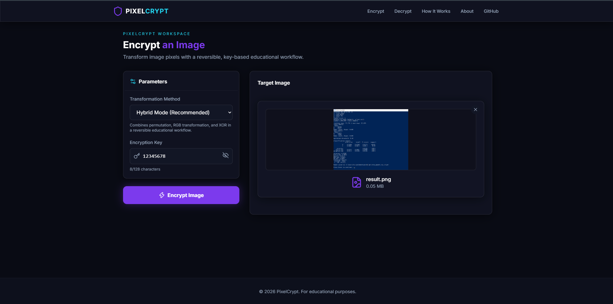
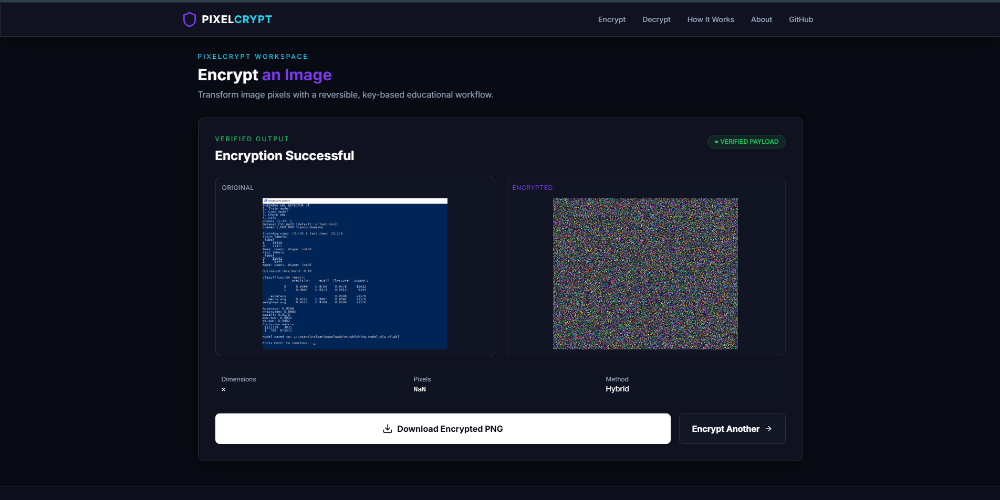
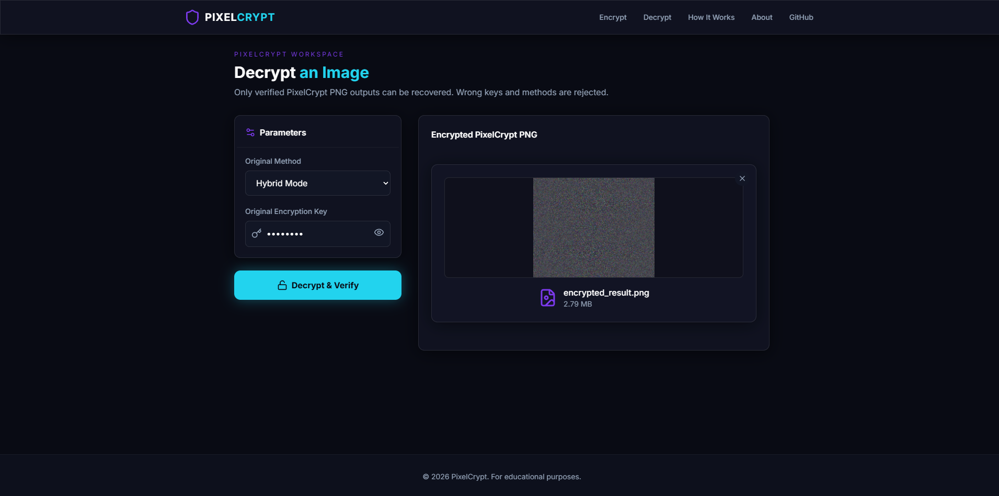
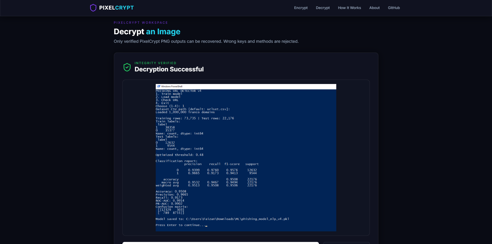
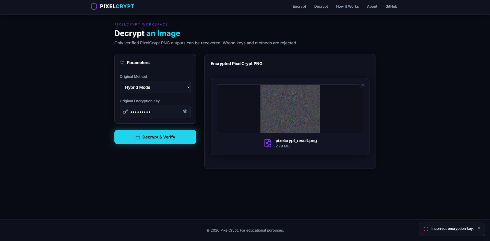
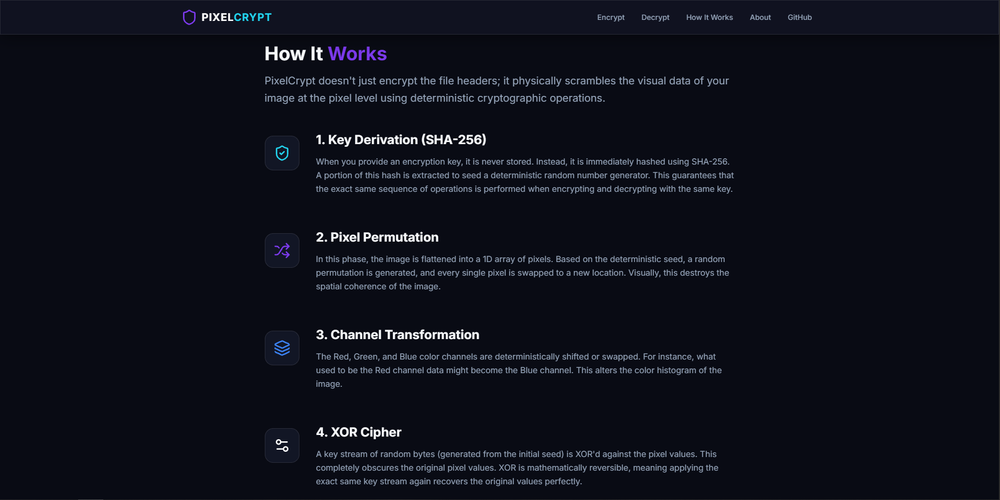

# 🔐 PixelCrypt — Image Encryption Through Pixel Manipulation

A modern full-stack web application for **encrypting and decrypting images through reversible pixel-level transformations**.

PixelCrypt allows users to upload an image, select an encryption method, provide a secret key, encrypt the image, and later recover it using the correct key and method. The application combines a modern cybersecurity-inspired interface with multiple educational image-transformation algorithms.
---

## ✨ Features

- 🖼️ Upload and process images through a modern web interface
- 🔐 Key-based image transformation
- 🔄 Image encryption and decryption workflows
- 🧩 Multiple reversible pixel manipulation methods
- ⚡ Hybrid encryption mode
- 🔢 XOR pixel transformation
- 🔀 Pixel position permutation
- 🎨 RGB channel permutation
- 👁️ Image previews
- 📊 Image metadata display
- 🔑 Encryption key visibility toggle
- ❌ Wrong-key and incorrect-method detection
- 🛡️ Input and file validation
- 📱 Responsive interface
- 🌐 REST API backend
- 🧪 Automated backend tests

---

# 📸 Application Screenshots

## 🏠 Home Page

The landing page introduces PixelCrypt and provides access to the encryption and decryption tools.


---

## 🔐 Encryption Workspace

Users can upload an image, choose an encryption method, enter a secret key, and start the encryption process.



---

## 🔒 Encrypted Image Result

After processing, PixelCrypt displays the encrypted image and allows the user to download the result.



---

## 🔓 Decryption Workspace

Users can upload an encrypted image and provide the correct encryption method and key to recover the original image.



---

## ✅ Decrypted Image Result

When the correct key and method are provided, the image is successfully recovered and verified.



---

## ❌ Incorrect Key Detection

PixelCrypt detects failed verification and prevents the application from falsely reporting a successful recovery when an incorrect key or method is used.



---

## 🧠 How It Works

The application includes a dedicated page explaining the pixel-level transformation process and the available methods.



---

# ⚙️ How PixelCrypt Works

## Encryption Workflow

```text
Upload Image
    │
    ▼
Select Encryption Method
    │
    ▼
Enter Secret Key
    │
    ▼
Pixel-Level Transformation
    │
    ▼
Encrypted Image
    │
    ▼
Download
```

## Decryption Workflow

```text
Upload Encrypted Image
    │
    ▼
Select Correct Method
    │
    ▼
Enter Correct Secret Key
    │
    ▼
Reverse Transformation
    │
    ▼
Verify Recovered Result
    │
    ▼
Recovered Image
```

---

# 🔐 Encryption Methods

## 1. XOR Pixel Transformation

This method performs a reversible bitwise operation on pixel values using a key-derived transformation.

```text
Encrypted Pixel = Original Pixel XOR Key Stream
```

The same operation can be reversed using the correct key.

---

## 2. Pixel Position Permutation

This method rearranges pixel positions using a deterministic sequence generated from the encryption key.

The correct key reproduces the same sequence, allowing the transformation to be reversed.

---

## 3. RGB Channel Permutation

This method transforms image data by applying reversible operations to the red, green, and blue pixel channels.

---

## 4. Hybrid Mode ⭐

Hybrid Mode combines multiple reversible pixel-level transformations.

```text
Original Image
      │
      ▼
Key-Derived Transformation
      │
      ▼
Pixel Manipulation
      │
      ▼
Channel / Value Transformation
      │
      ▼
Encrypted Image
```

During decryption, the transformations are reversed in the appropriate order using the correct key and method.

---

# 🛡️ Validation and Verification

The application includes validation for:

- Supported image formats
- Invalid files
- Corrupted images
- Empty uploads
- File size limits
- Invalid encryption methods
- Empty encryption keys
- Short encryption keys
- Incorrect decryption keys
- Incorrect decryption methods

The application also verifies the recovered result to reduce the risk of falsely reporting a successful decryption when the wrong key or transformation method is supplied.

---

# 🧰 Technology Stack

## Frontend

- Next.js
- TypeScript
- React
- Tailwind CSS
- Lucide Icons

## Backend

- Python
- FastAPI
- Pillow
- NumPy
- Uvicorn

## Testing

- Pytest

---

# 📂 Repository Structure

```text
Prodigy-Infotech-PixelCrypt-Image-Encryption/
│
├── README.md
├── LICENSE
├── .gitignore
├── .env.example
│
├── backend/
│   ├── main.py
│   ├── requirements.txt
│   ├── algorithms/
│   ├── api/
│   ├── models/
│   ├── services/
│   └── tests/
│
├── frontend/
│   ├── app/
│   │   ├── page.tsx
│   │   ├── layout.tsx
│   │   ├── globals.css
│   │   ├── encrypt/
│   │   ├── decrypt/
│   │   └── how-it-works/
│   │
│   ├── components/
│   ├── lib/
│   ├── public/
│   ├── package.json
│   └── package-lock.json
│
└── screenshots/
    ├── home.png
    ├── encryption-page.png
    ├── encrypted-result.png
    ├── decryption-page.png
    ├── decrypted-result.png
    ├── how-it-works.png
    └── incorrect_key.png
```

---

# 🚀 Installation

## Prerequisites

Make sure you have installed:

- Python 3.10 or later
- Node.js 18 or later
- npm

---

# 🖥️ Backend Setup

Navigate to the backend directory:

```bash
cd backend
```

Create a virtual environment:

```bash
python -m venv venv
```

Activate the environment.

### Windows

```bash
venv\Scripts\activate
```

### Linux/macOS

```bash
source venv/bin/activate
```

Install the required dependencies:

```bash
pip install -r requirements.txt
```

Start the FastAPI server:

```bash
uvicorn main:app --reload --port 8000
```

The backend should run at:

```text
http://localhost:8000
```

API documentation is available at:

```text
http://localhost:8000/docs
```

---

# 🌐 Frontend Setup

Open another terminal and navigate to the frontend directory:

```bash
cd frontend
```

Install dependencies:

```bash
npm install
```

Start the development server:

```bash
npm run dev
```

Open the application:

```text
http://localhost:3000
```

---

# 🧪 Running Tests

Navigate to the backend directory:

```bash
cd backend
```

Activate the virtual environment and run:

```bash
pytest
```

Or:

```bash
python -m pytest
```

---

# 🔌 API

The FastAPI backend provides endpoints for image processing and application health checks.

Available API documentation:

```text
http://localhost:8000/docs
```

---

# 🧪 Testing the Application

A typical workflow is:

```text
1. Start the backend
        │
        ▼
2. Start the frontend
        │
        ▼
3. Upload an image
        │
        ▼
4. Select an encryption method
        │
        ▼
5. Enter a secret key
        │
        ▼
6. Encrypt the image
        │
        ▼
7. Download the encrypted image
        │
        ▼
8. Open the Decrypt page
        │
        ▼
9. Upload the encrypted image
        │
        ▼
10. Use the same method and key
        │
        ▼
11. Recover and verify the image
```

---

# ⚠️ Important Security Note

PixelCrypt is an **educational project focused on reversible pixel manipulation and image transformation**.

The included methods demonstrate concepts such as:

- XOR operations
- Key-based transformations
- Pixel permutation
- RGB/channel manipulation
- Deterministic transformations
- Reversible image processing

This project should **not be considered a replacement for established cryptographic systems** such as AES-GCM or ChaCha20-Poly1305 for protecting sensitive data.

For real-world protection of sensitive images, established and peer-reviewed cryptographic libraries and authenticated encryption standards should be used.

---

# 🚀 Future Improvements

Possible future enhancements include:

- AES-GCM encryption mode
- Password-based key derivation
- Batch image processing
- Drag-and-drop uploads
- Image comparison slider
- Encryption history
- User authentication
- Docker deployment
- Cloud deployment
- Rate limiting
- Advanced metadata sanitization
- Additional transformation methods

---

# 📜 License

This project is licensed under the terms specified in the [LICENSE](LICENSE) file.

---

## 🔐 PixelCrypt

**Upload • Transform • Encrypt • Verify • Recover**

A portfolio project demonstrating pixel-level image transformation, reversible algorithms, full-stack development, API design, validation, testing, and cybersecurity concepts.
